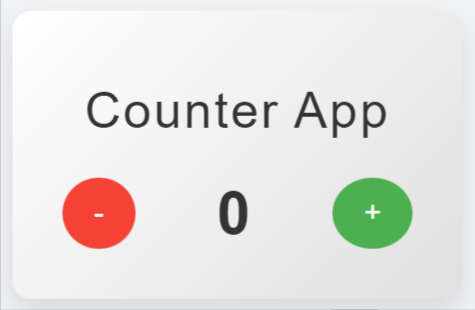

# Getting Started with Create React App

This project was bootstrapped with [Create React App](https://github.com/facebook/create-react-app).

## Available Scripts

In the project directory, you can run:

### `npm start`

Runs the app in the development mode.\
Open [http://localhost:3000](http://localhost:3000) to view it in your browser.

The page will reload when you make changes.\
You may also see any lint errors in the console.

### `npm test`

Launches the test runner in the interactive watch mode.\
See the section about [running tests](https://facebook.github.io/create-react-app/docs/running-tests) for more information.

### `npm run build`

Builds the app for production to the `build` folder.\
It correctly bundles React in production mode and optimizes the build for the best performance.

# Counter App

A simple and visually appealing counter application built with React. Users can increment and decrement the counter value. The app is styled to provide a modern user interface and is deployed using GitHub Pages.

## Demo

Check out the live demo of the app [here](https://dveersingh000.github.io/Counter-App/).

## Features

- Increment and Decrement counter functionality
- Modern and responsive design
- Interactive button effects

## Screenshots

